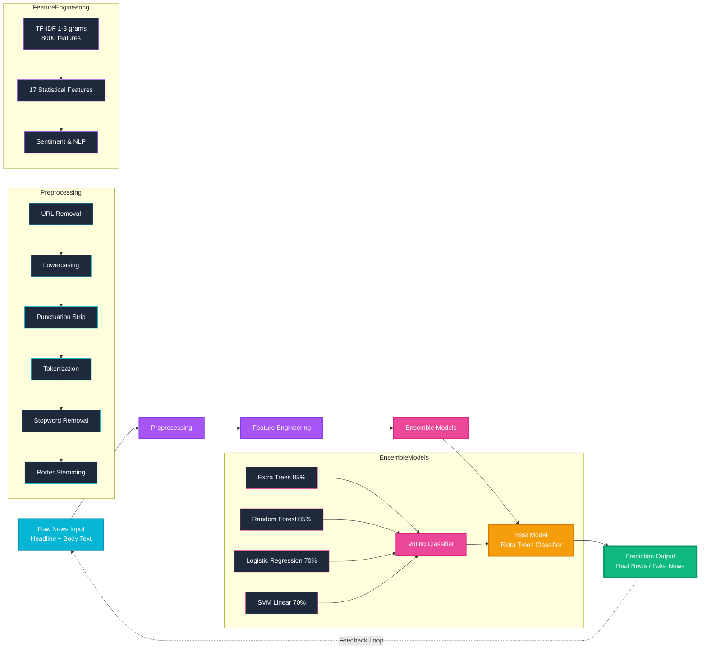
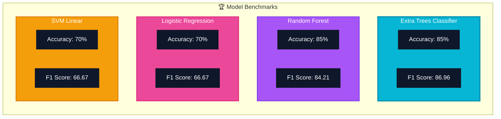
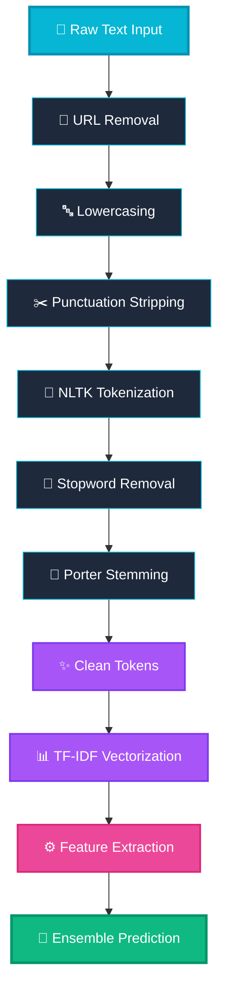

<div align="center">

# 🛡️ NeuroGuard FND

**AI-Powered Misinformation Detection System**

Advanced NLP | Ensemble ML | Real-time Analysis

[](https://github.com/issu321/Fake-News-Flask)
[](https://python.org)
[](https://flask.palletsprojects.com)
[](https://scikit-learn.org)

[](https://www.nltk.org)
[](https://www.sqlalchemy.org)
[](LICENSE)
[]()
[]()
[]()

</div>

---

## 🚀 Quick Start

> Get up and running in under 2 minutes!

### Prerequisites
- Python 3.10 or higher
- pip package manager

### Step 1: Clone the Repository
```bash
git clone https://github.com/issu321/Fake-News-Flask.git
cd Fake-News-Flask
```

### Step 2: Install Dependencies
```bash
pip install -r requirements.txt
```

### Step 3: Run the Application

**Option A: Desktop App (Recommended)**
```bash
python app.py
```
Launches a **native desktop window** with the full application.

**Option B: Web Browser**
```bash
python app.py --server-only
```
Then open `http://127.0.0.1:5000/` in your browser.

---

## 📊 Project Overview

| Metric | Value | Description |
|:------:|:-----:|:-----------:|
| **Model Accuracy** | 85% | Extra Trees Classifier |
| **F1 Score** | 86.96 | Weighted Average |
| **Total Features** | 17 | Statistical + TF-IDF |
| **N-Gram Range** | 1-3 | 8000 Vectorized Features |

---

## 🏗️ System Architecture

```mermaid
graph TD
    A[User<br/>Web / Desktop Client] -->|HTTP Request| B[Flask Application<br/>Routes | Auth | API | Templates]
    B -->|Process| C[ML Pipeline Engine]
    C -->|Store Data| D[SQLite Database<br/>Users | Predictions | History]
    C -->|Return Result| E[Prediction Output<br/>Real / Fake + Confidence %]
    B -->|Serve Response| A

    style A fill:#06b6d4,stroke:#0891b2,stroke-width:3px,color:#fff
    style B fill:#a855f7,stroke:#7c3aed,stroke-width:3px,color:#fff
    style C fill:#ec4899,stroke:#db2777,stroke-width:3px,color:#fff
    style D fill:#f59e0b,stroke:#d97706,stroke-width:3px,color:#fff
    style E fill:#10b981,stroke:#059669,stroke-width:3px,color:#fff
```

---

## 🧠 Machine Learning Pipeline



---

## 📈 Model Performance Comparison



| Model | Type | Accuracy | F1 Score |
|-------|------|----------|----------|
| **Extra Trees** | Ensemble | 85.0% | 86.96 |
| **Random Forest** | Ensemble | 85.0% | 84.21 |
| **Logistic Regression** | Linear | 70.0% | 66.67 |
| **SVM (Linear)** | Linear | 70.0% | 66.67 |

**Best Model: Extra Trees Classifier**

---

## 🔬 Feature Engineering Breakdown

```mermaid
graph TD
    subgraph TextStatistics["📏 Text Statistics"]
        T1[Character Count]
        T2[Word Count]
        T3[Sentence Count]
        T4[Average Word Length]
        T5[Unique Word Ratio]
    end

    subgraph LinguisticPatterns["📝 Linguistic Patterns"]
        L1[Capitalization Ratio]
        L2[Punctuation Density]
        L3[Exclamation Count]
        L4[Question Mark Count]
        L5[Sentence Length Patterns]
    end

    subgraph SentimentNLP["🧠 Sentiment & NLP"]
        S1[Sentiment Polarity]
        S2[Subjectivity Score]
        S3[Sensational Word Frequency]
        S4[Emotional Trigger Words]
        S5[Stopword Ratio]
    end

    subgraph TFIDF["🔢 TF-IDF Vectorization"]
        V1[N-Gram Range: 1-3 grams]
        V2[Max Features: 8,000]
        V3[Vectorizer: TF-IDF]
        V4[Preprocessing: Stemmed Tokens]
    end

    T1 & T2 & T3 & T4 & T5 --> FE[⚙️ Feature Extraction Engine]
    L1 & L2 & L3 & L4 & L5 --> FE
    S1 & S2 & S3 & S4 & S5 --> FE
    V1 & V2 & V3 & V4 --> FE
    FE --> ML[🧬 ML Ensemble Model]

    style T1 fill:#06b6d4,stroke:#0891b2,color:#fff
    style T2 fill:#06b6d4,stroke:#0891b2,color:#fff
    style T3 fill:#06b6d4,stroke:#0891b2,color:#fff
    style T4 fill:#06b6d4,stroke:#0891b2,color:#fff
    style T5 fill:#06b6d4,stroke:#0891b2,color:#fff
    style L1 fill:#a855f7,stroke:#7c3aed,color:#fff
    style L2 fill:#a855f7,stroke:#7c3aed,color:#fff
    style L3 fill:#a855f7,stroke:#7c3aed,color:#fff
    style L4 fill:#a855f7,stroke:#7c3aed,color:#fff
    style L5 fill:#a855f7,stroke:#7c3aed,color:#fff
    style S1 fill:#ec4899,stroke:#db2777,color:#fff
    style S2 fill:#ec4899,stroke:#db2777,color:#fff
    style S3 fill:#ec4899,stroke:#db2777,color:#fff
    style S4 fill:#ec4899,stroke:#db2777,color:#fff
    style S5 fill:#ec4899,stroke:#db2777,color:#fff
    style V1 fill:#f59e0b,stroke:#d97706,color:#fff
    style V2 fill:#f59e0b,stroke:#d97706,color:#fff
    style V3 fill:#f59e0b,stroke:#d97706,color:#fff
    style V4 fill:#f59e0b,stroke:#d97706,color:#fff
    style FE fill:#10b981,stroke:#059669,stroke-width:3px,color:#fff
    style ML fill:#f59e0b,stroke:#d97706,stroke-width:3px,color:#fff
```



### Feature Categories

| Category | Features | Count |
|----------|----------|-------|
| **Text Statistics** | Character count, word count, sentence count, avg word length, unique word ratio | 5 |
| **Linguistic Patterns** | Capitalization ratio, punctuation density, exclamation count, question count, sentence length | 5 |
| **Sentiment & NLP** | Sentiment polarity, subjectivity, sensational words, emotional triggers, stopword ratio | 5 |
| **TF-IDF** | 1-3 grams, 8000 features, stemmed tokens | 2 |

---

## 🧪 NLP Preprocessing Pipeline



| Stage | Tool | Output |
|-------|------|--------|
| **URL Removal** | Regex | Clean text string |
| **Lowercasing** | Python `.lower()` | Normalized text |
| **Punctuation Strip** | Regex | Alphanumeric text |
| **Tokenization** | NLTK Word Tokenizer | Token list |
| **Stopword Removal** | NLTK English Stopwords | Filtered tokens |
| **Stemming** | Porter Stemmer | Root word forms |
| **Vectorization** | scikit-learn TF-IDF | Sparse matrix (8000 dim) |

---

## 🔐 Authentication System

```mermaid
graph LR
    A[📝 Register<br/>Username | Email | Password<br/>PBKDF2-SHA256 Hash] --> B[🔑 Login<br/>Verify Credentials<br/>Session Created]
    B --> C[🛡️ Access Control<br/>Protected Routes<br/>Dashboard Only]
    C --> D[🔓 Logout<br/>Session Destroyed<br/>Cookie Cleared]
    D -.->|Redirect| A

    style A fill:#06b6d4,stroke:#0891b2,stroke-width:3px,color:#fff
    style B fill:#a855f7,stroke:#7c3aed,stroke-width:3px,color:#fff
    style C fill:#ec4899,stroke:#db2777,stroke-width:3px,color:#fff
    style D fill:#10b981,stroke:#059669,stroke-width:3px,color:#fff
```

---

## 📋 Requirements

```bash
pip install -r requirements.txt
```

| Dependency | Version | Purpose |
|------------|---------|---------|
| **Python** | 3.10+ | Core Runtime |
| **Flask** | 2.0+ | Web Framework |
| **Flask-Login** | Latest | Session Management |
| **SQLAlchemy** | Latest | ORM & Database |
| **scikit-learn** | 1.3+ | ML Models |
| **NLTK** | Latest | NLP Processing |
| **pandas** | Latest | Data Manipulation |
| **numpy** | Latest | Numerical Computing |
| **pywebview** | Latest | Desktop App Shell |

---

## 🏗️ Project Structure

```
fake_news_detector/
├── app.py                 # Main application (desktop + web)
├── run.py                 # Alternative entry point
├── config.py              # Configuration settings
├── requirements.txt       # Python dependencies
├── best_model.pkl         # Trained ML ensemble model
├── model_results.pkl      # Model benchmark results
├── news_dataset.csv       # Training dataset
├── models/
│   ├── __init__.py        # DB + LoginManager init
│   ├── user.py            # User model (SQLAlchemy)
│   └── predictor.py       # Enhanced NLP predictor
├── routes/
│   ├── __init__.py        # Blueprint registration
│   ├── main.py            # Home, Features, About, Contact
│   ├── auth.py            # Login, Register, Logout
│   └── dashboard.py       # Predict API, Batch API, Stats
├── static/
│   ├── css/style.css      # Full UI styling (2000+ lines)
│   ├── js/neurons.js      # Interactive neuron background
│   ├── js/main.js         # Scroll reveal, nav, counters
│   └── js/dashboard.js    # Dashboard interactions
├── templates/
│   ├── base.html          # Master template
│   ├── index.html         # Home page
│   ├── features.html      # Features showcase
│   ├── about.html         # About project
│   ├── contact.html       # Contact page
│   ├── login.html         # Login form
│   ├── register.html      # Registration form
│   ├── dashboard.html     # Main dashboard
│   ├── 404.html           # Not found page
│   └── 500.html           # Server error page
└── instance/
    └── users.db           # SQLite database (auto-created)
```

---

## 🎨 UI Features

| Feature | Description | Status |
|---------|-------------|--------|
| **Interactive Neuron Network** | HTML5 Canvas animated background | Active |
| **Glassmorphism Design** | Backdrop blur with neon glow | Active |
| **Gradient Animations** | Smooth CSS transitions | Active |
| **Neon Glow Effects** | Cyan / Purple / Pink accents | Active |
| **Scroll Reveal** | Animated page entrance | Active |
| **Animated Counters** | Statistics with count-up | Active |
| **Responsive Mobile-First** | All screen sizes | Active |
| **Dark Theme** | Optimized for readability | Active |

---

## 📡 API Endpoints

| Endpoint | Method | Auth | Description |
|----------|--------|------|-------------|
| `/` | `GET` | No | Home page |
| `/features` | `GET` | No | Features page |
| `/about` | `GET` | No | About page |
| `/contact` | `GET` | No | Contact page |
| `/auth/register` | `POST` | No | Create account |
| `/auth/login` | `POST` | No | Login |
| `/auth/logout` | `GET` | Yes | Logout |
| `/dashboard/` | `GET` | Yes | Dashboard |
| `/dashboard/api/predict` | `POST` | Yes | Single text prediction |
| `/dashboard/api/predict-batch` | `POST` | Yes | CSV batch prediction |
| `/dashboard/api/stats` | `GET` | Yes | Model performance stats |
| `/api/model-stats` | `GET` | No | Public model info |

---

## 👨‍💻 Developer

| | |
|:---|:---|
| **GitHub** | [@issu321](https://github.com/issu321) |
| **Repository** | [https://github.com/issu321/Fake-News-Flask](https://github.com/issu321/Fake-News-Flask) |
| **Email** | [jaafreeusman@gmail.com](mailto:jaafreeusman@gmail.com) |
| **Phone** | +91 8884294749 |

---

## 📄 License

This project is for **educational and research purposes**.

---

<div align="center">

**Built with passion for truth and technology**

**NeuroGuard FND 2024**

</div>
